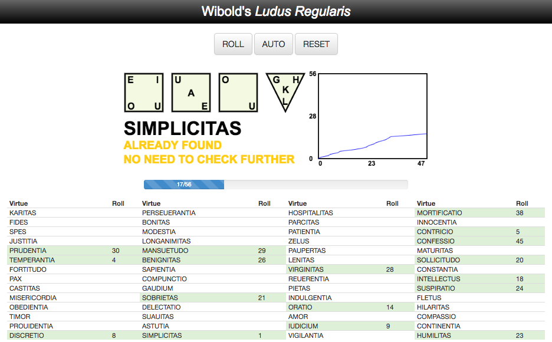

# Wibold's _Ludus Regularis_

A dice game originating in 10th century Flanders. This applet was created to accompany an [article in _Convergence_](http://www.maa.org/press/periodicals/convergence/wibolds-ludus-regularis-a-10th-century-board-game), a publication from the Mathematical Association of America that focuses on the history of mathematics.

See the article for the rules of the game and the history behind it.

